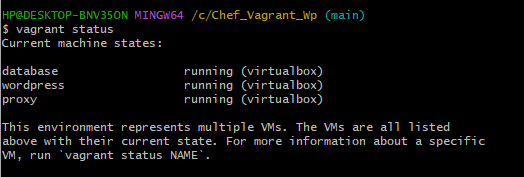
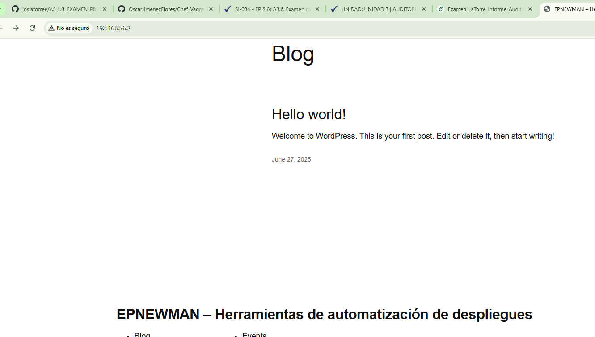

## Facultad de Ingeniería - Carrera Profesional de Sistemas  
### Examen de Unidad  
### Informe de Auditoría de Sistemas  
**Auditor:** La Torre Esquivel, José André  
**Fecha:** 27 de junio de 2025  
**Repositorio**: https://github.com/joslatorree/AS_U3_EXAMEN_PRACTICO.git

---

## 1. Resumen Ejecutivo

A continuación, se presenta el informe de auditoría del entorno de despliegue DevIA360, el cual se basa en el uso de herramientas como Vagrant y Chef para la automatización de infraestructura.  
Durante la auditoría se evaluó la ejecución, configuración y seguridad del entorno desplegado, identificando vulnerabilidades asociadas al manejo de credenciales, configuración de red y prácticas DevOps.  
Se propone una matriz de riesgos y recomendaciones para mitigar los hallazgos críticos y mejorar la eficiencia operativa.

---

## 2. Introducción

Este informe se elabora como parte del examen práctico de la asignatura Auditoría de Sistemas, enfocado en la revisión del entorno de despliegue continuo DevIA360, desplegado localmente con Vagrant y Chef.

### Objetivo General
Auditar el entorno DevIA360 para detectar vulnerabilidades en su configuración automatizada mediante Vagrant y Chef.

### Objetivos Específicos
1. Detectar exposición de credenciales y variables sensibles.
2. Verificar configuraciones de red no seguras o sin autenticación.
3. Revisar recetas de Chef para identificar configuraciones hardcodeadas.
4. Determinar la existencia de separación entre entornos (dev/prod).
5. Evaluar la falta de modularización y control de versiones.

---

## 3. Hallazgos Preliminares

### 3.1 Evidencia de ejecución

- **Anexo A**: `vagrant status`
  

- **Anexo B**: WordPress en ejecución
  

### 3.2 Configuraciones inseguras detectadas

- **Anexo C**: Vagrantfile expone IPs estáticas sin validación
  ```ruby
  db.vm.network "private_network", ip: ENV["DB_IP"]
  ```

- **Anexo D**: `.env` contiene credenciales en texto plano
  ```env
  DB_USER = 'wordpress'
  DB_PSWD = 'Epnewman123'
  ```

- **Anexo G**: No hay segregación de entornos (todo apunta a entorno único)
  ```ruby
  # No se usa ninguna variable ENV['ENVIRONMENT']
  # Todo el entorno apunta a configuración fija sin distinción entre producción y desarrollo
  ```

- **Anexo H**: Archivos de prueba `default_test.rb` sin validaciones activas
  ```ruby
  describe user('root'), :skip do
    it { should exist }
  end
  ```

- **Anexo I**: kitchen.yml define entornos pero no hay ejecución funcional (por falta de instalación)

---

## 4. Recomendaciones

- Reemplazar uso de `.env` por variables seguras y cifradas.
- Validar disponibilidad de IPs antes del despliegue.
- Separar configuraciones por entorno (dev/prod/test).
- Implementar pruebas funcionales en `default_test.rb`.
- Documentar control de versiones y activar seguridad por defecto.

---

## 5. Conclusiones

El entorno DevIA360 cumple su función técnica de desplegar WordPress, pero presenta fallas de seguridad y trazabilidad que lo hacen vulnerable.  
Las mejoras sugeridas deben ser implementadas antes de utilizar este entorno en producción, incluyendo pruebas activas, control de entornos y protección de credenciales.

---

## 6. Referencias

- Vagrant Docs: https://developer.hashicorp.com/vagrant/docs  
- Chef Infra Docs: https://docs.chef.io/chef/  
- OWASP DevSecOps Guide: https://owasp.org/www-project-devsecops-guideline/

---

## 7. Matriz de Riesgos

| Riesgo                        | Causa (Anexo)             | Impacto | Probabilidad | Nivel de Riesgo |
|------------------------------|---------------------------|---------|--------------|-----------------|
| Credenciales sin cifrado     | `.env`, `Vagrantfile` (D) | Alto    | 90%          | Crítico         |
| IPs fijas no validadas       | `.env` (C)                | Medio   | 75%          | Alto            |
| Ausencia de segregación      | Recetas y red (G)         | Medio   | 80%          | Alto            |
| Pruebas de seguridad inactivas | `default_test.rb` vacío (H) | Alto | 85%          | Alto            |
| kitchen no funcional         | falta de entorno Ruby/Chef (I) | Medio | 60%       | Medio           |
